# Vibe Design Translator

> **把模糊审美需求翻译成可执行前端 Prompt 的设计决策与诊断 SaaS**  
> Translate vague visual taste into executable frontend prompts.


---

## 目录

- [1. 项目一句话](#1-项目一句话)
- [2. 为什么做这个项目](#2-为什么做这个项目)
- [3. 它不是一个普通 UI 素材库](#3-它不是一个普通-ui-素材库)
- [4. 产品核心闭环](#4-产品核心闭环)
- [5. 核心用户](#5-核心用户)
- [6. 核心功能](#6-核心功能)
- [7. 产品流程可视化](#7-产品流程可视化)
- [8. 系统架构](#8-系统架构)
- [9. 数据结构与模块关系](#9-数据结构与模块关系)
- [10. 页面结构](#10-页面结构)
- [11. 技术栈](#11-技术栈)
- [12. 视觉设计语言](#12-视觉设计语言)
- [13. 合规策略](#13-合规策略)
- [14. 当前版本进度](#14-当前版本进度)
- [15. 如何运行](#15-如何运行)
- [16. 路线图](#16-路线图)
- [17. 面试展示重点](#17-面试展示重点)
- [18. 商业化思路](#18-商业化思路)

---

## 1. 项目一句话

**Vibe Design Translator** 是一个面向 AI Coding 用户的设计决策与诊断工具。  
它帮助用户在使用 **Codex / Claude Code / Gemini / WorkBuddy** 之前，把一句模糊的需求：

> “我想做一个高级一点的 AI 产品官网，但不要太 AI 味。”

翻译成一份 AI 能真正执行的前端设计任务书：

```text
设计方向
页面结构
视觉系统
交互动效
组件规则
验收标准
反 AI 味检查清单
工具专用 Prompt
```

---

## 2. 为什么做这个项目

现在很多人已经可以用 AI Coding 工具快速生成页面，但一个很常见的问题是：

> **功能能跑，但页面很像 AI 生成的模板。**

具体表现为：

| 表层问题 | 底层原因 |
|---|---|
| 页面看起来廉价 | 没有明确视觉系统 |
| Prompt 写不清楚 | 不知道怎么描述审美 |
| AI 输出同质化 | 缺少差异化设计约束 |
| 页面没有重点 | 没有视觉层级和转化路径 |
| 反复让 AI 改还是不满意 | 没有验收标准 |

这个项目的核心判断是：

> AI Coding 的瓶颈不只是代码能力，而是用户能不能把“想要的视觉结果”表达清楚。

### 一个比喻

AI Coding 工具像一个执行力很强的施工队。

但很多用户只会说：

```text
帮我盖一栋高级一点的房子。
```

施工队当然能盖，但结果很可能是“通用样板房”。

Vibe Design Translator 做的事情是：

```text
模糊审美想法
  ↓
设计反问
  ↓
设计方向
  ↓
页面结构
  ↓
视觉系统
  ↓
施工图级 Prompt
  ↓
AI Coding 工具执行
```

也就是说，它不是替代 AI Coding 工具，而是站在它前面，帮用户写出更像“设计任务书”的 Prompt。

---

## 3. 它不是一个普通 UI 素材库

这个项目最开始容易被误解成“UI 灵感库”或“前端设计素材库”。但它真正的产品定位不是收藏好看的图，而是：

> **把看不懂的高级审美，翻译成 AI 能执行的前端指令。**

| 类型 | 普通 UI 素材库 | Vibe Design Translator |
|---|---|---|
| 用户行为 | 浏览、收藏、找灵感 | 输入需求、获得决策、生成 Prompt、诊断结果 |
| 核心价值 | 看见好看的案例 | 理解为什么好看，并转成可执行方案 |
| 数据重点 | 图片、截图、案例 | 设计信号、结构规则、Prompt 编译、诊断标准 |
| 版权风险 | 容易涉及第三方截图搬运 | 使用原创抽象模式，不复制第三方素材 |
| 商业化价值 | 看更多素材 | 更少返工、更好 AI 输出、更清晰设计判断 |

---

## 4. 产品核心闭环

这个项目包含两个核心场景：

### 场景 A：生成前设计决策

用户还没开始写 Prompt，只知道自己想要“高级感”。系统通过反问，把模糊想法拆成设计方案。

### 场景 B：生成后页面诊断

用户已经用 AI 生成了页面，但觉得页面“太 AI”“太模板”“不高级”。系统根据描述和截图，输出诊断报告和修复 Prompt。

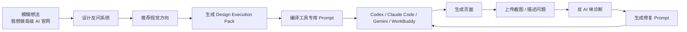

---

## 5. 核心用户

### 第一优先级用户

| 用户 | 痛点 | 为什么需要这个工具 |
|---|---|---|
| AI Coding 用户 | 会用 AI 写代码，但页面审美弱 | 需要把视觉需求说清楚 |
| 独立开发者 | 没有设计师，但要做产品官网 | 需要快速获得设计决策 |
| AI 产品新人 | 做作品集时页面容易像模板 | 需要更强的项目呈现力 |
| 创业者 / Founder | MVP 页面影响信任和转化 | 需要低成本提升视觉说服力 |
| 产品经理 | 不会写前端设计 Prompt | 需要把业务目标转成设计语言 |

### 用户最典型的一句话

```text
我知道自己想要高级一点，但我不知道怎么描述。
```

或者：

```text
这个页面功能是对的，但为什么看起来这么 AI？
```

---

## 6. 核心功能

### 6.1 三入口模式

用户进入产品后，不直接面对复杂表单，而是先选择当前状态。

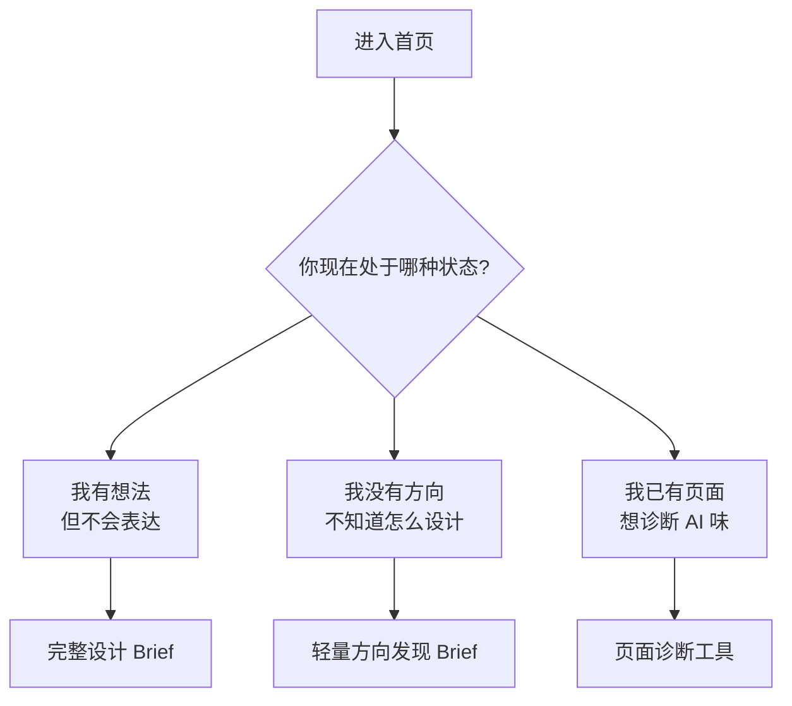

---

### 6.2 设计反问系统

系统不是简单问“你喜欢什么风格”，而是像一个设计顾问一样追问：

| 问题维度 | 示例问题 | 产品价值 |
|---|---|---|
| 第一印象 | 用户 3 秒内应该感受到什么？ | 明确视觉心理预期 |
| 商业优先级 | 转化、可信度、展示实力，哪个最重要？ | 决定页面结构 |
| 视觉倾向 | 更接近极简、结构化、开发者工具，还是原创？ | 决定设计语言 |
| 避免项 | 最不想出现哪种 AI 页面问题？ | 防止同质化 |
| 目标观众 | 给用户、面试官、投资人还是企业客户看？ | 决定表达策略 |

---

### 6.3 三种视觉方向推荐

系统会基于 Brief 推荐三种方向，并解释为什么适合。

| 方向 | 适合场景 | 气质 |
|---|---|---|
| Calm Professional | B2B、企业 AI、数据工具 | 冷静、可信、专业 |
| Soft Intelligent | 教育 AI、效率工具、轻量 SaaS | 温和、聪明、亲和 |
| Experimental Premium | AI Agent、开发者工具、前沿产品 | 高端、前沿、探索 |

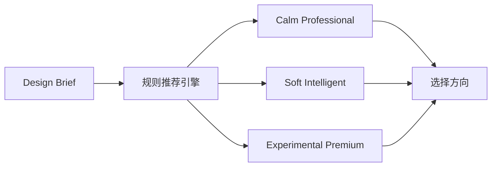

---

### 6.4 Design Execution Pack

这是产品最核心的输出。它不是一句 Prompt，而是一整套“设计执行包”。

```text
Design Execution Pack
├── Product Context
├── Design Strategy
├── Page Structure
├── Visual System
├── Interaction System
├── Content Tone
├── Component Rules
├── Responsive Rules
├── Acceptance Criteria
├── Anti-AI-Look Checklist
└── Tool-specific Prompt
```

---

### 6.5 Prompt Compiler

同一个设计方案，会根据不同 AI Coding 工具生成不同 Prompt。

| 工具 | Prompt 重点 |
|---|---|
| Codex | 文件结构、任务步骤、百分比进度、验收标准 |
| Claude Code | 先读代码库、分析问题、制定计划、分阶段重构 |
| Gemini | 终端执行、依赖检查、构建验证、错误修复 |
| WorkBuddy | 中文工程任务说明、强执行、少抽象、明确验收 |

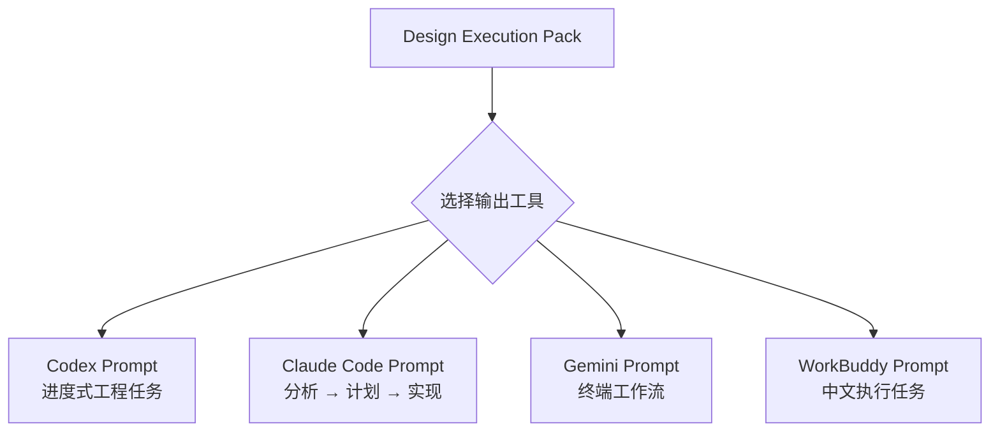

---

### 6.6 反 AI 味诊断

诊断模块会从多个维度判断页面是否像 AI 生成模板。

| 诊断维度 | 判断内容 |
|---|---|
| AI Template Feeling | 是否有明显模板感、生成感 |
| Visual Hierarchy | 视觉主次是否清晰 |
| Color Control | 色彩是否克制、有系统 |
| Typography System | 字体层级是否稳定 |
| Spacing System | 间距是否有节奏 |
| Interaction Restraint | 动效是否服务内容 |
| Conversion Clarity | CTA 和转化路径是否明确 |

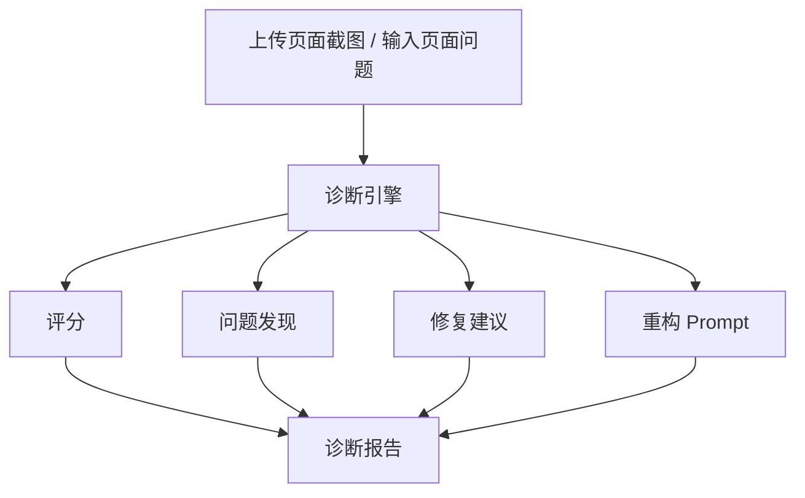

---

### 6.7 Project Workspace

项目已经支持本地工作区，用户可以管理多个设计项目。

| 能力 | 状态 |
|---|---|
| 创建项目 | 已完成 |
| 重命名项目 | 已完成 |
| 删除项目 | 已完成 |
| 复制项目 | 已完成 |
| JSON 导出 | 已完成 |
| Markdown 导出 | 已完成 |
| 保存诊断报告 | 已完成 |
| 保存 Prompt 导出 | 已完成 |

---

## 7. 产品流程可视化

### 7.1 用户完整路径

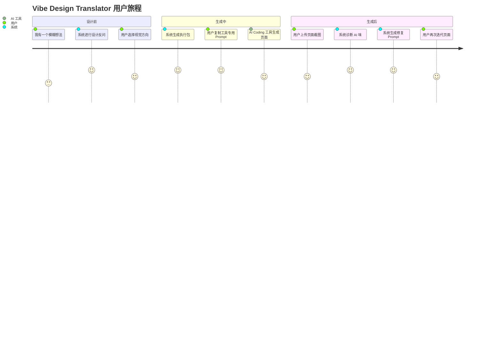

---

### 7.2 产品价值链

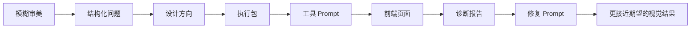

---

## 8. 系统架构

当前架构采用 **Next.js App Router + Zustand + localStorage + Provider Abstraction**。

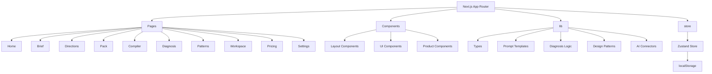

---

### 8.1 AI Provider 架构

项目已经预留真实 AI 接入层，目前默认走 Mock Provider。

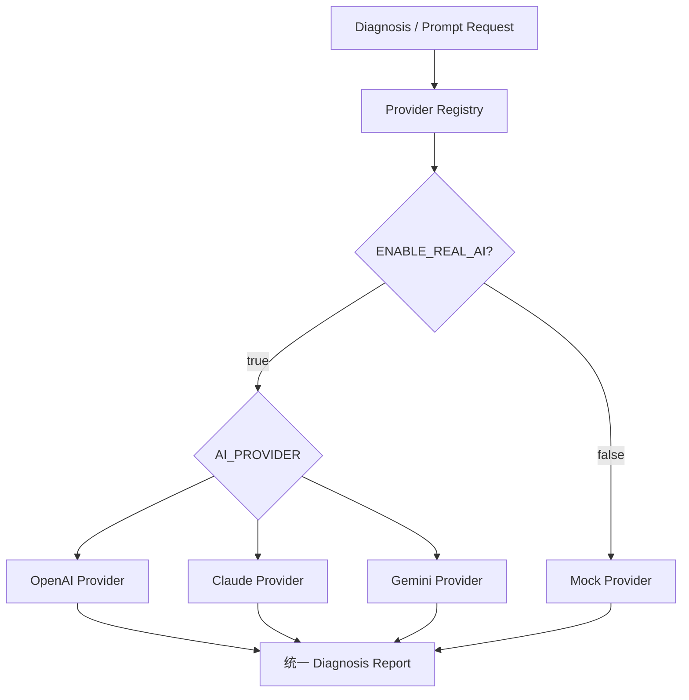

---

## 9. 数据结构与模块关系

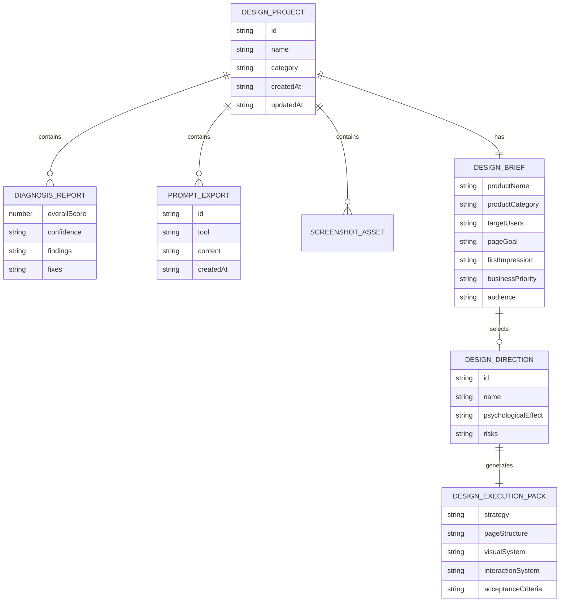

---

## 10. 页面结构

```text
app/
├── page.tsx              # 首页：三入口模式选择
├── brief/page.tsx        # 设计反问系统
├── directions/page.tsx   # 视觉方向推荐
├── pack/page.tsx         # Design Execution Pack
├── compiler/page.tsx     # 多工具 Prompt 编译器
├── diagnosis/page.tsx    # 页面诊断工具
├── patterns/page.tsx     # 原创设计模式库
├── workspace/page.tsx    # 项目工作区
├── pricing/page.tsx      # 定价展示页
└── settings/page.tsx     # 设置 / 历史 / 使用记录
```

```text
components/
├── layout/               # AppShell、导航、页面容器、背景
├── ui/                   # GlassCard、LiquidButton、ScoreBar、CopyButton
└── product/              # BriefForm、DirectionCard、DiagnosisReport、ScreenshotUploader
```

```text
lib/
├── types.ts              # 全局类型系统
├── constants.ts          # 选项和常量
├── design-patterns.ts    # 12 个原创设计模式
├── design-directions.ts  # 3 个视觉方向
├── prompt-templates.ts   # Prompt 编译逻辑
├── diagnosis.ts          # 诊断逻辑
├── storage.ts            # localStorage 工具
└── connectors/           # AI Provider 抽象层
```

---

## 11. 技术栈

| 分类 | 技术 |
|---|---|
| Framework | Next.js 14 App Router |
| Language | TypeScript strict mode |
| Styling | Tailwind CSS |
| State | Zustand |
| Persistence | localStorage |
| Icons | Lucide React |
| Animation | Framer Motion |
| AI Layer | Provider abstraction, Mock default |
| Future AI | OpenAI / Claude / Gemini |

---

## 12. 视觉设计语言

本项目视觉方向是：

> **Liquid Glass + Apple-like restraint + quiet luxury + low saturation**

不是为了炫，而是为了传达一种“设计决策工具”的安静专业感。

### 设计原则

| 原则 | 解释 |
|---|---|
| 少即是多 | 不用过多装饰，用清晰层级表达信息 |
| 克制的玻璃质感 | 玻璃效果只服务内容层级，不全页面滥用 |
| 低饱和色彩 | 避免廉价霓虹和蓝紫 AI 模板感 |
| 留白优先 | 让用户注意力集中在决策内容上 |
| 工具感而非玩具感 | 页面要像专业 SaaS，而不是炫技 Demo |

### 视觉关键词

```text
liquid glass
frosted surface
soft translucency
quiet luxury
low saturation
editorial spacing
subtle depth
calm futuristic
anti-template
```

---

## 13. 合规策略

这个项目明确不做“搬运型 UI 素材库”。

| 策略 | 说明 |
|---|---|
| 不保存第三方截图 | 避免版权风险 |
| 不复制品牌 UI | 只提炼抽象设计信号 |
| 不绕过付费站点 | 不做侵权爬虫 |
| 设计模式原创 | 使用可复用的抽象模式 |
| Prompt 不要求复刻 | 强调 implementation guidance，而非 copy |

项目中的 12 个 Design Patterns 是原创抽象模式，例如：

```text
Dark Liquid Hero
Soft Glass Navigation
Bento Feature Grid
Minimal Pricing Section
Agent Workflow Timeline
AI Prompt Editor Panel
```

---

## 14. 当前版本进度

当前版本：**Phase 3 AI Diagnosis Foundation**

| 模块 | 状态 |
|---|---|
| 三入口模式选择 | Complete |
| Enhanced Design Brief | Complete |
| Direction Recommendation Engine | Complete |
| Execution Pack Generator | Complete |
| Tool-specific Prompt Compiler | Complete |
| Markdown Export | Complete |
| Dynamic Mock Diagnosis | Complete |
| Screenshot Upload Preview | Complete |
| Project Workspace CRUD | Complete |
| AI Provider Abstraction | Complete |
| Real AI Vision Diagnosis | Prepared, not fully enabled |
| Auth / Database / Billing | Future |

### 当前完成度

```text
作品集展示完成度：88%
工程 MVP 完成度：85%
真实 AI SaaS 完成度：45%
商业化产品完成度：35%
```

---

## 15. 如何运行

```bash
# Clone repository
git clone https://github.com/liuanye9-lab/vibe-design-translator.git

cd vibe-design-translator

# Install dependencies
npm install

# Start dev server
npm run dev

# Open
http://localhost:3000
```

### 构建检查

```bash
npm run lint
npm run build
npx tsc --noEmit
```

---

## 16. 路线图

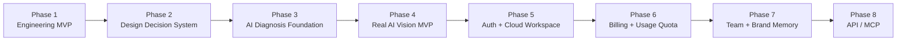

### 下一阶段重点

| 阶段 | 目标 |
|---|---|
| Phase 4 | 接入真实 Vision Diagnosis |
| Phase 5 | Supabase Auth + Database + Storage |
| Phase 6 | 使用额度、订阅、支付 |
| Phase 7 | 团队空间、品牌记忆、私有 Pattern Library |
| Phase 8 | API / MCP，接入 AI Coding 工具链 |

---

## 17. 面试展示重点

这个项目适合展示的不只是“我做了一个页面”，而是：

### 产品能力

```text
发现 AI Coding 用户的真实痛点：代码能生成，但设计结果不稳定。
```

### AI 产品思维

```text
不是简单调用模型，而是设计了：
设计反问 → 方向推荐 → Prompt 编译 → 诊断 → 修复 Prompt 的闭环。
```

### 工程能力

```text
Next.js App Router + TypeScript + Zustand + Provider Abstraction + Workspace。
```

### 设计能力

```text
把审美判断拆成可执行的结构化系统，而不是停留在“好看/不好看”。
```

### 合规意识

```text
不做第三方截图搬运，不复制品牌 UI，而是使用原创抽象设计模式。
```

---

## 18. 商业化思路

### 免费版

```text
基础设计方向生成
基础 Prompt 编译
少量诊断次数
本地 Workspace
```

### Pro 版

```text
真实 AI Vision 诊断
无限 Prompt 导出
项目云端保存
Markdown / JSON 导出
多工具 Prompt 优化
```

### Team 版

```text
团队项目空间
品牌规则记忆
私有设计模式库
批量页面诊断
API / MCP 集成
```

### 最核心付费点

不是“看更多素材”，而是：

> **帮用户把 AI 生成页面从模板感，修到更像真实产品。**

---

## License

MIT License

---

## Current Version

**Phase 3 AI Diagnosis Foundation**

```text
当前目标：从可展示工程 MVP，推进到真实 AI Vision 诊断 SaaS。
```
