# Vibe Design Translator

> **AI 时代的「设计翻译官」** —— 把你说不出口的审美，翻译成 AI 听得懂的指令


---

## 一句话说清楚

**Vibe Design Translator** 是一个「设计翻译官」，帮你把「我想要高级一点」这种模糊感觉，翻译成 AI 能执行的前端设计指令。

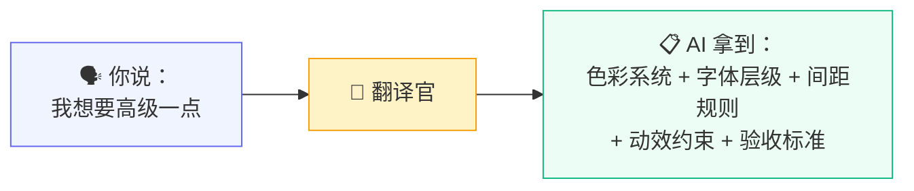

---

## 为什么需要这个「翻译官」？

### 一个真实场景

你用 AI Coding 工具（Claude Code / Cursor / Codex）生成了一个页面。

功能都对，但你总觉得：

> 「为什么看起来这么 AI？」

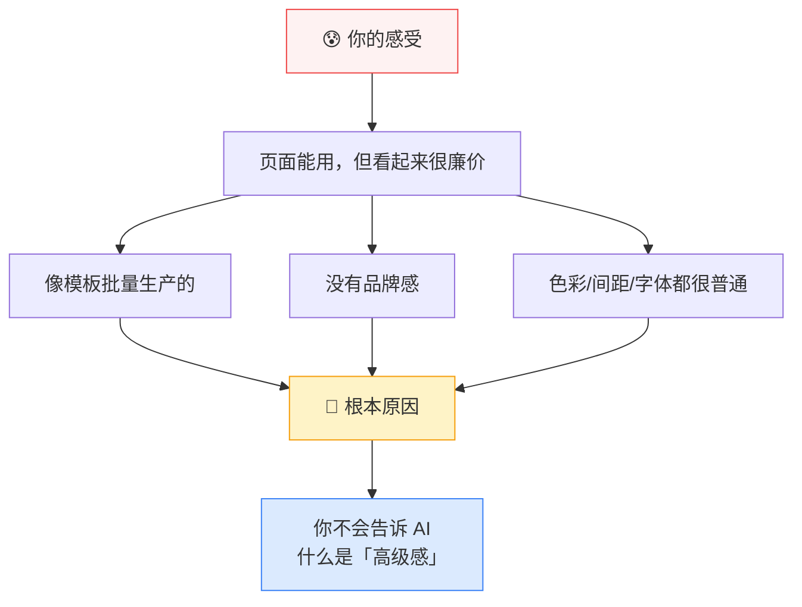

### 问题的本质

AI Coding 工具像一个**执行力超强的施工队**。

但你只说了一句：「帮我盖一栋高级一点的房子」

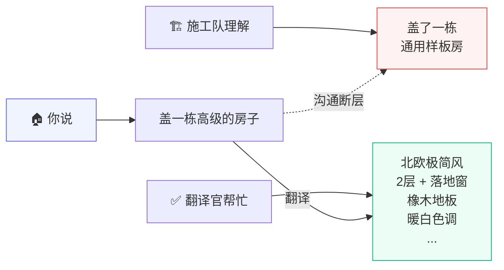

**Vibe Design Translator** 就是那个帮你把「高级感」翻译成具体参数的「设计顾问」。

---

## 它不是什么 vs 它是什么

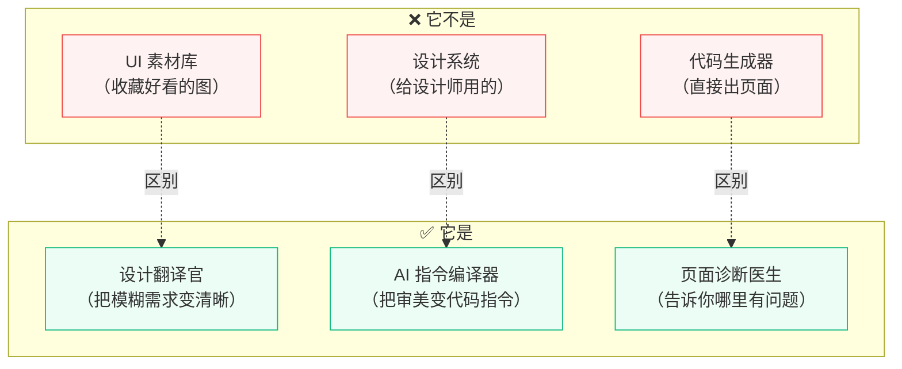

---

## 三个核心场景

### 场景 1：设计翻译（生图前）

> 「我知道自己想要高级一点，但我不知道怎么描述」

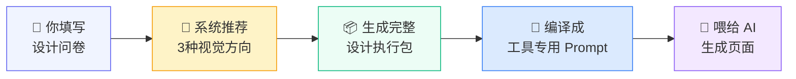

**类比**：你去找设计师聊需求，设计师帮你把「高级感」拆解成具体的色彩、字体、间距、动效规则，然后写成施工图交给施工队。

---

### 场景 2：页面诊断（生图后）

> 「这个页面功能是对的，但为什么看起来这么 AI？」

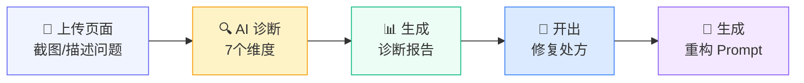

**类比**：你拍了张照片给医生看，医生说「你这个页面有 AI 味」，然后给你开了一张「修复处方」。

---

### 场景 3：Agent 工作流（全自动）

> 「让 AI 自己跑完整个设计流程」

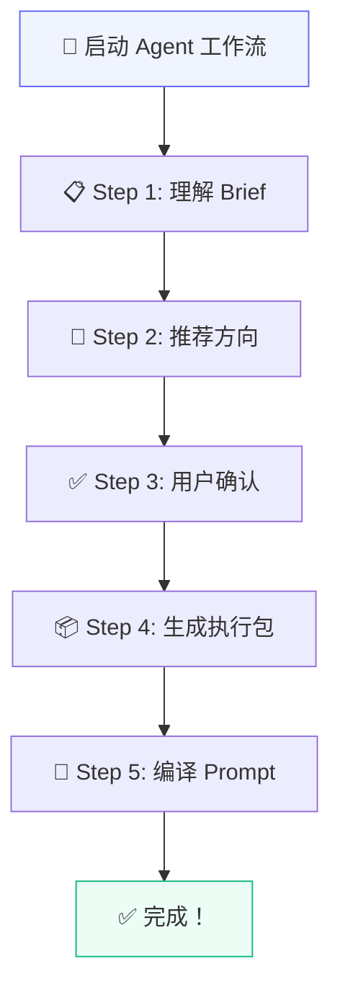

**类比**：你找了一个「设计项目经理」，他帮你协调整个流程，你只需要在关键节点确认一下。

---

## 核心能力一览

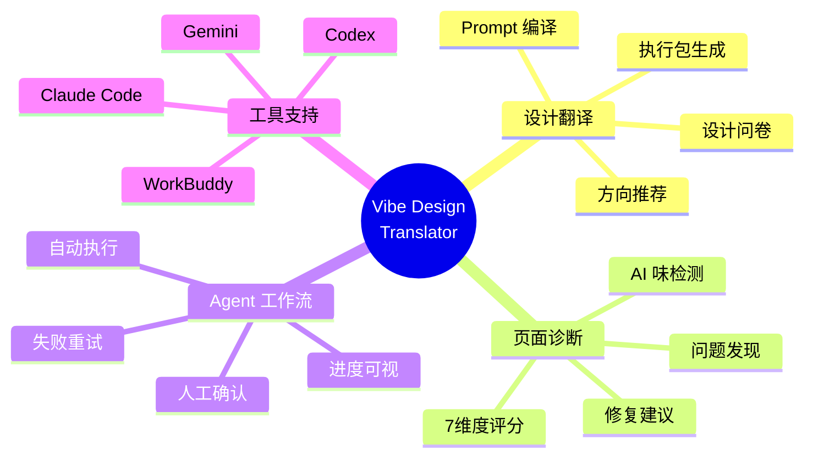

---

## 用户是谁？

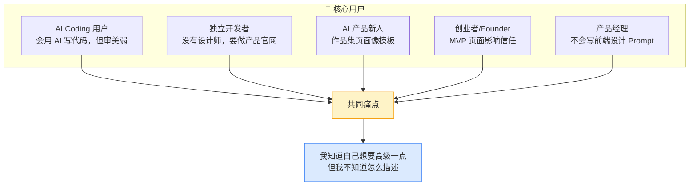

---

## 产品流程全景

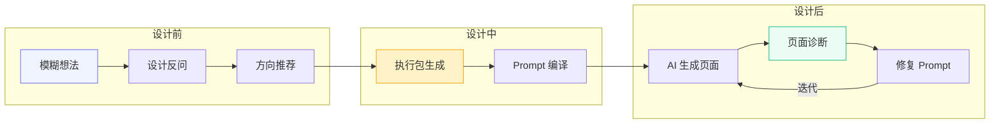

---

## 系统架构

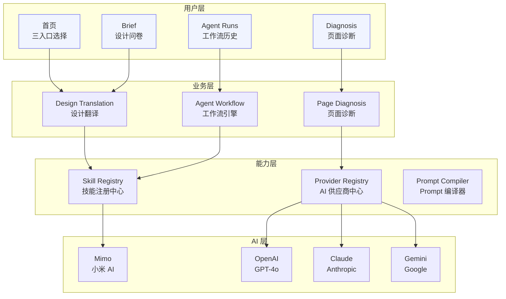

---

## 技术栈

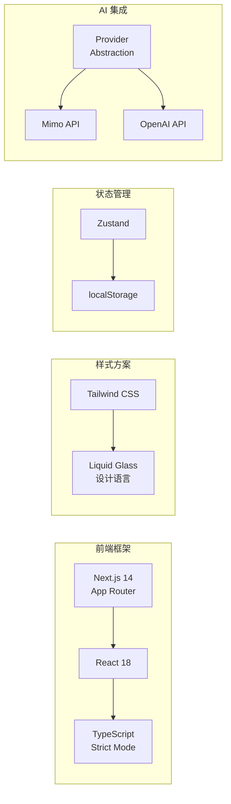

---

## 三种视觉方向

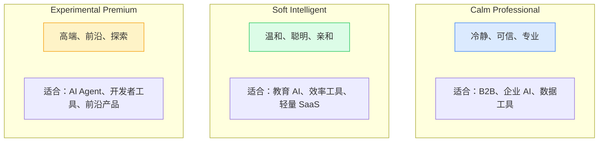

---

## 诊断维度

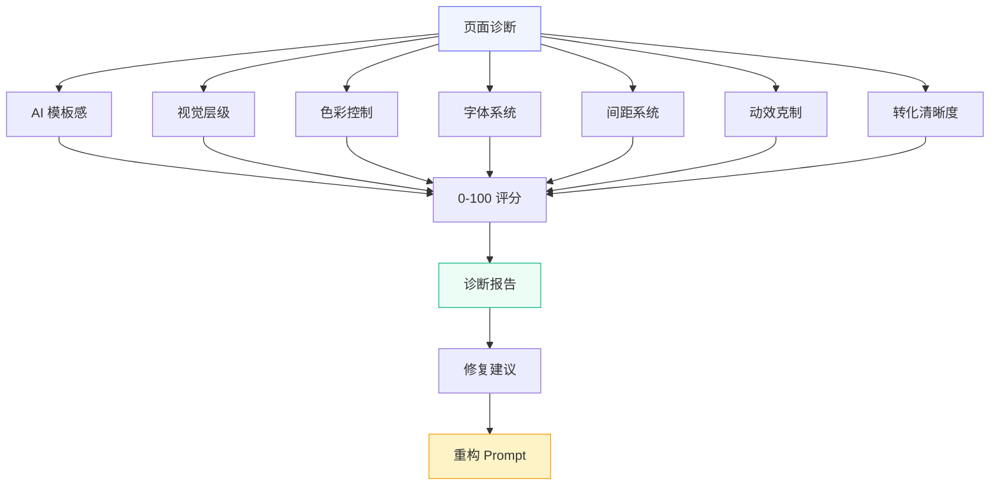

---

## 如何使用

### 1. 克隆项目

```bash
git clone https://github.com/liuanye9-lab/vibe-design-translator.git
cd vibe-design-translator
```

### 2. 安装依赖

```bash
npm install
```

### 3. 配置 AI（可选）

```bash
cp .env.example .env.local
# 编辑 .env.local，填入你的 API Key
```

### 4. 启动开发

```bash
npm run dev
```

### 5. 打开浏览器

访问 http://localhost:3000

---

## 项目结构

```
vibe-design-translator/
├── app/                    # 页面路由
│   ├── page.tsx           # 首页（三入口选择）
│   ├── brief/             # 设计问卷
│   ├── directions/        # 方向推荐
│   ├── pack/              # 执行包生成
│   ├── compiler/          # Prompt 编译器
│   ├── diagnosis/         # 页面诊断
│   ├── agent-runs/        # Agent 工作流历史
│   └── workspace/         # 项目工作区
│
├── components/            # 组件库
│   ├── layout/            # 布局组件
│   ├── ui/                # UI 组件
│   ├── product/           # 业务组件
│   └── agent/             # Agent 工作流组件
│
├── lib/                   # 核心逻辑
│   ├── agent/             # Agent 工作流
│   │   ├── types.ts       # 类型定义
│   │   ├── orchestrator.ts # 工作流引擎
│   │   ├── skill-registry.ts # 技能注册中心
│   │   └── skills/        # 7个技能模块
│   ├── connectors/        # AI 供应商
│   └── diagnosis.ts       # 诊断逻辑
│
└── docs/                  # 文档
    └── AGENT_WORKFLOW.md  # Agent 工作流文档
```

---

## 当前进度

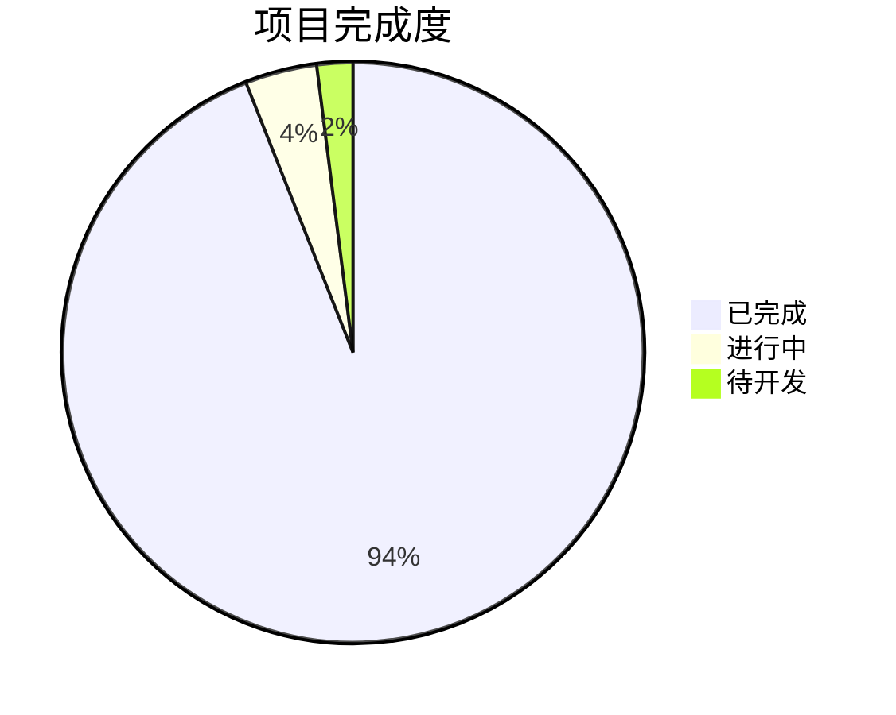

### Phase 5 Agent Workflow Foundation ✅

- ✅ Agent 类型系统
- ✅ 7 个 Agent Skills
- ✅ Skill Registry
- ✅ Workflow Orchestrator
- ✅ Agent UI 组件
- ✅ Agent Runs 页面
- ✅ Brief/Diagnosis 集成
- ✅ Mimo API 集成

---

## 路线图

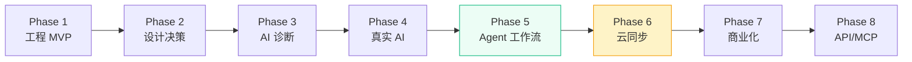

---

## 面试怎么说这个项目？

### 一句话版本

> 「我做了一个 AI 时代的『设计翻译官』，帮用户把模糊的审美需求翻译成 AI 能执行的前端指令。」

### 三句话版本

> 「现在很多人用 AI 写代码，但页面总是很像模板。我做的工具帮用户把『高级感』这种模糊需求翻译成具体的色彩、字体、间距规则，然后编译成不同 AI 工具的专用 Prompt。还加了诊断功能，能告诉用户页面哪里有问题、怎么修。」

### 亮点展开

1. **产品能力**：发现真实痛点（AI 生成页面同质化）
2. **AI 产品思维**：不是简单调用模型，而是设计了完整的翻译-诊断闭环
3. **工程能力**：Next.js + TypeScript + Zustand + Provider 抽象层
4. **设计能力**：把审美判断拆成可执行的结构化系统
5. **Agent 架构**：实现了可视化的工作流引擎

---

## 商业模式

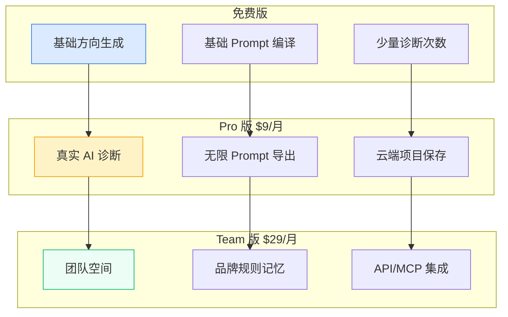

---

## 合规说明

- ✅ 不保存第三方截图
- ✅ 不复制品牌 UI
- ✅ 使用原创抽象设计模式
- ✅ 不做侵权爬虫

---

## License

MIT License

---

## 当前版本

**Phase 5 Agent Workflow Foundation**

> 从「设计决策工具」升级为「Agent 化设计决策工作流系统」

---

<div align="center">

**[文档](./docs/AGENT_WORKFLOW.md)** · **[GitHub](https://github.com/liuanye9-lab/vibe-design-translator)** · **Issues**

</div>
